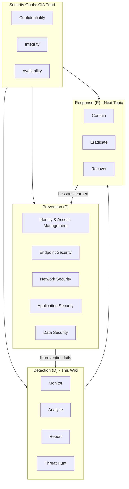
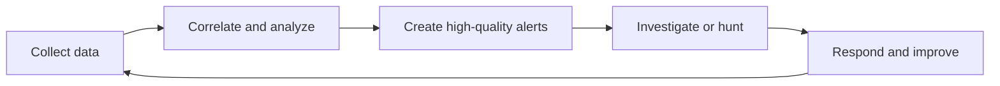

# 08 Cybersecurity Detection

> **S = P + D + R**  
> **Security = Prevention + Detection + Response**

This Wiki explains the **Detection (D)** part of cybersecurity in a beginner-friendly way. It focuses on how organizations use monitoring, analysis, reporting, threat hunting, SIEM, and XDR to find problems faster.

---

## The Security Equation

| Letter | Meaning | Purpose |
|---|---|---|
| **P** | Prevention | Stop attacks before they succeed |
| **D** | Detection | Find suspicious or malicious activity |
| **R** | Response | Contain, fix, recover, and learn |

The **CIA triad** is the “what”:

- **Confidentiality** — keep information from the wrong people.
- **Integrity** — keep data accurate and trustworthy.
- **Availability** — keep systems usable when needed.

Prevention, detection, and response are the “how” used to protect the CIA triad.

---

## Big Picture Diagram



### Simple text version

```text
Prevention                Detection                         Response
 IAM / Endpoint    -->   Monitor -> Analyze -> Report   -->  Contain
 Network / App / Data      Threat Hunting                    Eradicate / Recover
```

---

## What Was Covered Before?

The earlier cybersecurity domains — IAM, endpoint security, network security, application security, and data security — are mostly **prevention** controls.

This Wiki starts the **detection** side:

1. **Monitor** — collect information from systems and networks.
2. **Analyze** — turn raw data into useful alerts and patterns.
3. **Report** — show trends, metrics, and management visibility.
4. **Threat hunt** — proactively look for hidden problems.

---

## Main Technologies

| Technology | What it means | Main job |
|---|---|---|
| **SIEM** | Security Information and Event Management | Central visibility, correlation, alerting, reporting |
| **XDR** | Extended Detection and Response | Endpoint-focused detection, response, and federated search |
| **SOC** | Security Operations Center | People and process that monitor, investigate, report, and respond |

---

## How to Use This Wiki

| Page | What you will learn |
|---|---|
| [Detection Overview](/Detection-Overview) | The detection process: monitor, analyze, report, hunt |
| [SOC](/SOC) | What a Security Operations Center does |
| [SIEM](/SIEM) | How SIEM collects and analyzes security data |
| [XDR](/XDR) | How XDR extends detection and response, including federated search |
| [SIEM vs XDR](/SIEM-vs-XDR) | How SIEM and XDR compare and why they work together |
| [Threat Hunting](/Threat-Hunting) | Why proactive hunting matters and how it works |
| [Response](/Response) | Placeholder for the next topic: response |
| [Glossary](/Glossary) | Key terms in plain language |

---

## Core Idea

Detection is not just “turning on alarms.” Detection is a loop:



Next: [Detection Overview](/Detection-Overview)
